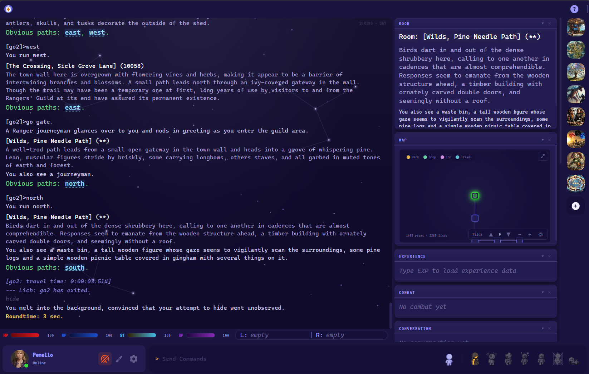
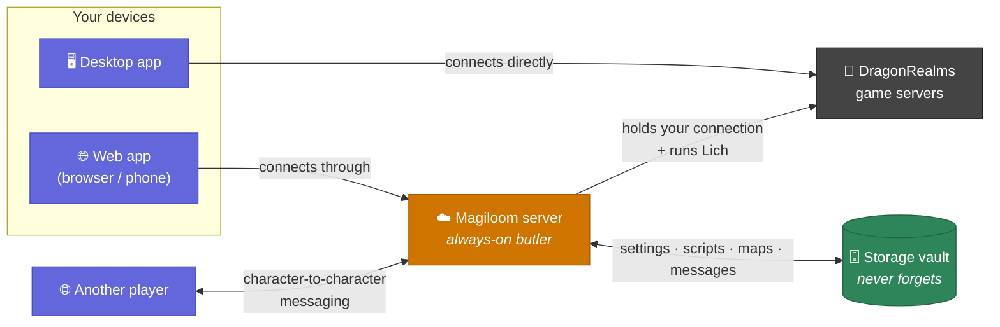

  

<h1 align="center">Magiloom</h1>

  A modern, lightweight client for <a href="https://www.play.net/dr/">DragonRealms</a>

  
  
  

 

---

##  Features

- **Live vitals** — Health, mana, stamina, and spirit bars update in real time from the game stream
- **Smart panels** — Room info, experience tracker, active spells, combat log, conversation history, inventory, and atmosphere — all collapsible, resizable, and individually toggleable
- **Clickable exits** — Room exits are links; click to move
- **Command history** — Arrow keys recall previous commands
- **Text highlights** — Color-code any word, phrase, or regex pattern in the output
- **Multiple themes** — Choose from several dark color themes; changes apply instantly
- **Adjustable display** — Pick your font family and size
- **Lich integration** — Optionally launch [Lich5](https://lichproject.org/) scripts alongside your session
- **Auto-update** — Checks for new releases on startup and prompts to install

  

---

##  Play in Your Browser

No install required — Magiloom also runs as a **web app** at **[magiloom.com/app](https://magiloom.com/app)**. It works in any modern desktop or mobile browser, and on your phone you can use **Add to Home Screen** to install it as a full-screen app (with push notifications for your alerts).

Just sign in and play — there's nothing to install and nothing to configure. Your game session even survives briefly minimizing the app, so a quick switch away won't drop your character.

---

##  How It All Fits Together

Magiloom comes in two flavors, and it helps to picture what's happening behind the scenes.

**The desktop app** is self-contained. When you run it on your computer, it talks *directly* to the DragonRealms game servers. Everything — your connection, your settings, your Lich scripts — lives on your machine. Nothing else is needed.

**The web app** can't do that, because a browser (especially on a phone) isn't allowed to open the kind of raw connection the game needs, or to run Lich. So instead of connecting to the game itself, the web app connects to a small **always-on Magiloom server** that runs in the cloud. Think of it as your personal butler that sits between your browser and the game:

- It holds the live connection to DragonRealms for you (and runs Lich, if you want it).
- Because it's always on, your character stays connected even when you close the browser tab or lock your phone. Open the app again later and you pick up right where you left off.
- It does the heavy lifting a phone can't — like generating character portraits — and hands the finished result back to your screen.

**The storage vault.** Attached to that server is a piece of permanent storage — a **mounted volume**, in tech terms. It's basically a hard drive in the cloud that never forgets. Whenever you change a setting, save a Lich script, explore a new room on the automapper, or send a message to another player, it gets written to this vault. Servers can restart or update, but the vault keeps everything safe and waiting.

The neat part is what this unlocks:

- **Your stuff follows you.** Because your settings and scripts live in the vault instead of on any one device, you get the same experience whether you're on your desktop web browser or your phone — no copying files around.
- **Players can talk to each other.** Since the server knows which characters are online, Magiloom has its own built-in messaging: add a friend, and you can message them character-to-character, completely separate from in-game chat. Messages you receive while offline wait for you in the vault.

In short: the **desktop app** is the go-it-alone option, and the **web app + cloud server + storage vault** is the always-on, sync-everywhere, message-your-friends option. Same Magiloom either way — pick whichever fits how you play.

---

##  Download

Prefer a native desktop app? Grab the latest installer from the [Releases page](https://github.com/jackfperryjr/magiloom/releases/latest).

| Platform | File |
|----------|------|
| Windows  | `Magiloom-Setup-x.x.x.exe` |
| macOS    | `Magiloom-x.x.x.dmg` |
| Linux    | `Magiloom-x.x.x.AppImage` |

> **Windows note:** You may see a SmartScreen prompt on first launch. Click **More info → Run anyway**. This is expected for apps without a paid code-signing certificate.

---

##  Getting Started

1. Launch Magiloom and sign in with your Simutronics account credentials.
2. Select your game server and character.
3. Play — panels populate automatically as game data arrives.

For a full feature walkthrough, see the **[Player Guide](GUIDE.md)**.

---

##  Lich Scripting

Lich is optional — Magiloom works as a standalone client without it.

1. Install Ruby and [Lich5](https://github.com/elanthia-online/lich-5) via the Ruby4Lich5 installer.
2. In Magiloom's **⚙ Settings**, set the **Lich path** to your `lich.rbw` (e.g. `C:\Ruby4Lich5\Lich5\lich.rbw`).
3. Log in normally — Magiloom handles authentication and launches Lich automatically.

Once connected with Lich active, `;commands` route through Lich's scripting engine.

---

##  Wizard Scripting

Magiloom also has its own **built-in script engine** for classic `.cmd` scripts — the same format used by the Wizard and Genie front-ends. Unlike Lich, this needs no Ruby and no extra setup: it runs right inside the app and works on any connection, direct or through Lich.

1. In **⚙ Settings → Scripts**, point the **Scripts folder** at a directory of your `.cmd` files.
2. Open the **Scripts** panel from the sidebar to see, run, and stop them — or type a script by name in the command bar.

Scripts are triggered with a leading `.` (to keep them distinct from Lich's `;`):

- `.hunt` — run the `hunt.cmd` script
- `.hunt orc` — run it with an argument (available inside the script as `%1`)
- `.stop` / `.kill` — halt all running scripts

The engine aims for full **Genie compatibility**, so common commands like `put`, `echo`, `pause`, `match`/`matchwait`, `waitfor`, `goto`, `gosub`, variables, counters, and conditionals all work as you'd expect. You can even wire scripts into your [aliases and triggers](GUIDE.md) so they fire automatically.

---

##  Tech Stack

| Layer | Technology |
|-------|------------|
| Shell | [Electron](https://www.electronjs.org/) 31 |
| UI | [React](https://react.dev/) 18 + [Jotai](https://jotai.org/) |
| Build | [electron-vite](https://electron-vite.org/) + [electron-builder](https://www.electron.build/) |
| Protocol | Simutronics SGE / GSIV XML |

---

  Magiloom is an unofficial community client &mdash; DragonRealms is a product of <a href="https://www.play.net">Simutronics Corp</a>.

